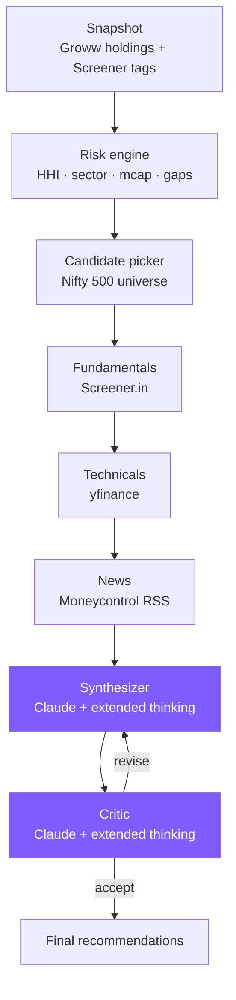

# PennyWise

> Agentic portfolio advisor for retail Indian investors on Groww.
> Talks to your live holdings, runs the risk math locally, and uses a
> Claude reasoning loop to suggest concrete Buy / Hold / Sell / Trim
> actions — every number backed by a tool call, not LLM training data.

```
$ uv run pennywise chat

you: am I over-concentrated?
pennywise: Yes — Financial Services is 34.5% of your stock book (HHI 0.21,
borderline "concentrated"). Your top holding, RECLTD, is 12.3%. Banks
alone are 22%. Trimming RECLTD to ~10% and adding one IT or Healthcare
name (both currently <3%) would bring HHI under 0.15.
```

## Why this exists

The Groww app shows what you own. It doesn't tell you whether you're
over-exposed to financials, whether your tech name's RSI is in oversold
territory, or which mid-cap candidate would best plug the gap between
your equity and the broad market. PennyWise does — and shows its work.

## Architecture



Two design choices worth calling out:

- **Reasoning models on the analytical nodes.** Synthesis and critique
  are the two places where Claude has to weigh many signals at once; we
  give them extended-thinking budgets so they can plan internally before
  emitting the final recommendation. Every other node is pure Python.

- **Snapshot persistence.** `pennywise snapshot` does the slow, network-
  heavy tagging once; downstream commands (`risk`, `recommend`, `chat`)
  read the on-disk snapshot and finish in seconds. Re-tagging is opt-in
  via `--fresh`.

## Quickstart

### CLI (local use)

```bash
git clone https://github.com/udit-amin/PennyWise.git
cd PennyWise
uv sync
cp .env.example .env       # then fill in GROWW_API_TOKEN + ANTHROPIC_API_KEY
uv run pennywise snapshot  # ~30-60s the first time
uv run pennywise chat      # ask anything
```

### API + Docker (for a frontend)

The FastAPI backend exposes the same tools over REST + WebSocket, with
Google OAuth and DynamoDB-backed session persistence.

```bash
cp .env.example .env       # fill in ANTHROPIC_API_KEY, GROWW_API_TOKEN,
                           # GOOGLE_CLIENT_ID, GOOGLE_CLIENT_SECRET
docker-compose up          # starts API on :8000, DynamoDB-local on :8042
```

API docs are auto-generated at `http://localhost:8000/docs` once the
server is running.

To run the API without Docker:

```bash
uv sync
uv run uvicorn pennywise.api.app:create_app --factory --reload
```

## CLI commands

| Command | What it does | Network |
|---|---|---|
| `pennywise login groww` | Interactive wizard: enter Groww API key + secret, validate, store in `~/.pennywise/credentials.json`. | Groww |
| `pennywise login google` | Browser OAuth: opens Google sign-in, receives callback on `localhost:18765`, stores identity + tokens. | Google |
| `pennywise snapshot` | Fetch Groww holdings + LTP, tag every ticker with sector / industry / market cap from Screener, persist to `~/.pennywise/snapshot.json`. | Groww + Screener |
| `pennywise risk` | Read snapshot, compute HHI / sector mix / market-cap mix / gaps, generate LLM commentary. | Anthropic only |
| `pennywise recommend` | Run the full LangGraph workflow: candidate pick → fundamentals → technicals → news → synthesis → critique → finalize. | All sources |
| `pennywise chat` | Interactive REPL. Claude has tool access to your portfolio. | Anthropic + on-demand |

### Credential storage

`pennywise login groww` and `pennywise login google` both persist to
`~/.pennywise/credentials.json` (mode 0600 — owner read/write only).
All subsequent commands pick up stored credentials automatically; you
don't need to keep secrets in `.env`.

Groww daily access tokens are automatically re-exchanged from the stored
API key + secret when they expire (~23 h), so you only need to run
`pennywise login groww` once.

**Google OAuth prerequisites** (needed only for `pennywise login google`):

1. Create OAuth 2.0 credentials in
   [Google Cloud Console](https://console.cloud.google.com/apis/credentials)
   (Application type: **Desktop app**).
2. Add `http://localhost:18765/callback` as an authorised redirect URI.
3. Set `GOOGLE_CLIENT_ID` and `GOOGLE_CLIENT_SECRET` in `.env`, or enter
   them at the prompt the first time you run the command.

## Chat interface

`pennywise chat` is the headline UX. Claude is wired up with seven
deterministic tools — three read the cached portfolio, three pull live
market data, one runs the full workflow:

| Tool | Source | Speed |
|---|---|---|
| `get_holdings` | snapshot | instant |
| `get_risk_metrics` | snapshot | instant |
| `analyze_ticker(symbol)` | snapshot | instant |
| `fetch_technicals(symbol)` | yfinance (live) | ~2-4s |
| `fetch_fundamentals(symbol)` | Screener.in (live) | ~1-2s |
| `fetch_news(symbol)` | Moneycontrol RSS (live) | ~1-2s |
| `list_recommendations(focus)` | full LangGraph workflow | ~30s |

Live tools accept ANY NSE symbol — held or not — so questions like
*"should I buy INFY?"* trigger fundamentals + technicals fetches and a
real, signal-cited answer.

```bash
uv run pennywise chat                 # resume the most recent session
uv run pennywise chat --new           # start fresh instead
uv run pennywise chat --session <id>  # resume a specific session
uv run pennywise chat --verbose       # trace every tool call
uv run pennywise chat --no-reasoning  # skip extended thinking
```

### Session persistence

Every chat is autosaved to `~/.pennywise/chats/<id>.json` after every
turn (atomic write — a crash mid-conversation never corrupts the file).

By default `pennywise chat` resumes the most recent session, so you can
exit, come back tomorrow, and continue where you left off — Claude
still has the conversation context.

In-REPL commands:

```
/help       list commands
/new        start a fresh session (saves the current one first)
/sessions   list saved sessions, newest first
/load <id>  resume a specific session
/where      print the path to the current session file
/verbose    toggle tool-call tracing
/quit       exit (already saved)
```

## API endpoints

All API routes require a JWT from the Google OAuth flow (except `/health`).

| Method | Path | Description |
|---|---|---|
| GET | `/health` | Health check |
| GET | `/api/auth/google/url` | Get Google OAuth URL |
| POST | `/api/auth/google/callback` | Exchange auth code for JWT |
| GET | `/api/auth/me` | Current user info |
| POST | `/api/auth/groww-credentials` | Store Groww API credentials |
| GET | `/api/portfolio/holdings` | User's holdings with sector + P&L |
| GET | `/api/portfolio/risk` | Concentration / risk metrics |
| GET | `/api/tools/technicals/{symbol}` | Live technical indicators |
| GET | `/api/tools/fundamentals/{symbol}` | Live fundamentals from Screener |
| GET | `/api/tools/news/{symbol}` | Recent Moneycontrol headlines |
| POST | `/api/recommendations` | Start recommendation workflow (async job) |
| GET | `/api/recommendations/{job_id}` | Poll job status |
| WebSocket | `/api/chat/ws?token=<jwt>` | Streaming chat with tool calls |

## MCP integration (optional)

Register PennyWise alongside Groww's official MCP server in
`~/.claude.json` so prompts inside any Claude Code session can invoke
the same tools:

```json
{
  "mcpServers": {
    "groww": {
      "command": "npx",
      "args": ["-y", "@groww/mcp"],
      "env": { "GROWW_API_TOKEN": "<bearer>" }
    },
    "pennywise": {
      "command": "uv",
      "args": ["run", "python", "-m", "pennywise.mcp.server"],
      "cwd": "/absolute/path/to/PennyWise"
    }
  }
}
```

Then `claude /mcp` will show both servers; ask *"What sector am I
over-exposed to?"* and the chat client will call
`pennywise.portfolio_risk` directly.

## Configuration

All knobs live in `.env`:

| Var | Default | Meaning |
|---|---|---|
| `GROWW_API_TOKEN` | — | Daily access token from Groww dashboard. |
| `GROWW_API_KEY` / `GROWW_API_SECRET` | — | Alternative: PennyWise mints the daily token from these. |
| `ANTHROPIC_API_KEY` | — | Required for `risk`, `recommend`, `chat`. |
| `PENNYWISE_LLM_MODEL` | `claude-opus-4-7` | Claude model id. Sonnet-class models also work and cost ~3× less. |
| `PENNYWISE_REASONING_EFFORT` | `medium` | Adaptive-thinking effort for Synthesizer / Critic (`low` / `medium` / `high`). |
| `PENNYWISE_HHI_FLAG` | `0.25` | HHI threshold for the "concentrated" flag. |
| `PENNYWISE_TOP_NAME_FLAG` | `0.20` | Single-name weight that triggers a TRIM suggestion. |
| `PENNYWISE_LARGE_CAP_FLOOR_CR` | `80000` | AMFI top-100 floor (H1 2025). |
| `PENNYWISE_MID_CAP_FLOOR_CR` | `28000` | AMFI top-250 floor (H1 2025). |
| `GOOGLE_CLIENT_ID` | — | Google OAuth client ID (API backend only). |
| `GOOGLE_CLIENT_SECRET` | — | Google OAuth client secret (API backend only). |
| `JWT_SECRET` | `pennywise-dev-secret-change-me` | JWT signing secret (API backend only). |
| `DYNAMODB_ENDPOINT` | — | DynamoDB-local URL; leave unset for real AWS. |
| `CORS_ORIGINS` | `localhost:3000,5173` | Comma-separated allowed origins. |

Refresh the market-cap floors biannually from
[amfiindia.com → Categorization of Stocks][amfi].

[amfi]: https://www.amfiindia.com/research-information/other-data

## Tests

```bash
uv run pytest -q
```

65 tests, all offline — mocked HTTP responses and inline HTML fixtures,
no live calls. Adding a new connector? Add a test that asserts the
parser handles real response shapes.

## Project layout

```
pennywise/
├── cli.py                 # typer entrypoint
├── chat.py                # interactive REPL + tool definitions
├── config.py              # .env loading
├── snapshot.py            # on-disk portfolio cache
├── tagging.py             # build_snapshot() — holdings + LTP + Screener tags
├── connectors/            # groww / screener / yfinance / moneycontrol
├── analytics/             # pure-python risk math, sector canonicalisation
├── agents/                # one node per workflow step
│   ├── _llm.py            # shared structured-output helper (with reasoning)
│   ├── strategy_synthesizer.py
│   ├── strategy_critic.py
│   └── ...
├── graph/                 # LangGraph state + workflow wiring
├── api/                   # FastAPI backend
│   ├── app.py             # application factory
│   ├── auth.py            # Google OAuth + JWT
│   ├── db.py              # DynamoDB persistence
│   ├── streaming.py       # WebSocket chat adapter
│   ├── background.py      # thread-pool job runner
│   ├── models.py          # Pydantic request/response schemas
│   └── routes/            # auth, portfolio, tools, chat, recommendations
├── mcp/                   # FastMCP server exposing tools
└── data/
    └── universe.csv       # static Nifty-universe candidate pool
```

## Roadmap

- [ ] Live AMFI category lookup instead of threshold-based mcap bucketing.
- [ ] XIRR + dividend history (Groww publishes both via the portfolio API).
- [ ] Optional Streamlit dashboard for the chat surface.
- [ ] Per-user snapshot persistence in the API (currently uses the shared CLI snapshot).

## License

MIT — see [LICENSE](LICENSE).

## Disclaimer

PennyWise is a research prototype. It is **not** investment advice. Read
every recommendation critically before acting on it; the LLM can be
confidently wrong, which is exactly why every claim is wired back to a
tool call you can audit.
