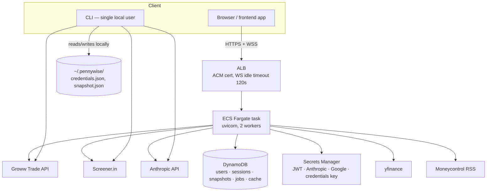
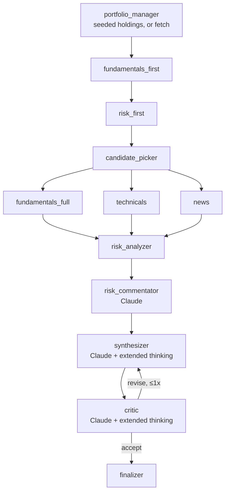

# Architecture

System design reference for PennyWise. For a product-level overview and
quickstart, see the [README](../README.md); for how to operate a
deployment day-to-day, see [OPERATIONS.md](OPERATIONS.md).

## System overview



The CLI and the API share almost all business logic (`pennywise/agents/`,
`pennywise/analytics/`, `pennywise/connectors/`, `pennywise/graph/`) but are
architecturally separate on one axis: **the CLI is single-user and reads
local files; the API is multi-user and reads DynamoDB.** See
[Multi-user portfolio resolution](#multi-user-portfolio-resolution) below —
this is the layer that keeps them from diverging.

## Request path (HTTP)

```
Browser → ALB → uvicorn worker → FastAPI route
                                    → asyncio.to_thread(db.*)   [DynamoDB, sync boto3]
                                    → asyncio.to_thread(<sync business logic>)
```

Every route-boundary DynamoDB call runs via `asyncio.to_thread` — boto3 is
synchronous, and the event loop must not block on it (`pennywise/api/auth.py`
`current_user`, `pennywise/api/routes/*.py`). `pennywise/api/db.py` itself
stays plain sync; background-job threads call it directly without the async
wrapper.

## The recommendation workflow (LangGraph)



- `fundamentals_full` / `technicals` / `news` fan out in parallel (LangGraph
  waits for all three before `risk_analyzer`).
- Only `synthesizer` and `critic` get extended-thinking budgets — the two
  nodes that weigh many signals at once. Every other node is deterministic
  Python; the numbers in a recommendation always trace back to a tool call,
  never to the LLM's training data.
- Typical latency: 30–100s (Anthropic calls + Screener throttling dominate).
  That's why `POST /api/recommendations` returns a job id immediately and
  runs the workflow in `pennywise/api/background.py` instead of blocking
  the HTTP request.
- `portfolio_manager_node` short-circuits when `holdings` are already present
  in the initial state (`pennywise/agents/portfolio_manager.py`) — the API
  always pre-seeds them; only the CLI path lets this node fetch.

## Multi-user portfolio resolution

The key design decision that makes one codebase serve both a single-user CLI
and a multi-user API: **all user-specific portfolio data flows through one
artifact, the `Snapshot`** (`pennywise/snapshot.py`) — holdings + positions
tagged with sector/industry/market-cap. Everything downstream (risk engine,
chat tools, the recommendation workflow) consumes a `Snapshot`, never
Groww credentials directly.

```mermaid
graph LR
    subgraph "CLI (default path)"
        C1[GrowwConnector()<br/>env vars / ~/.pennywise] --> C2[build_snapshot]
        C2 --> C3[~/.pennywise/snapshot.json]
    end

    subgraph "API (per-user path)"
        A1["POST /api/auth/groww-credentials<br/>(verified, Fernet-encrypted)"] --> A2[(users table<br/>groww_credentials_enc)]
        A3["POST /api/portfolio/upload<br/>CSV/XLSX"] --> A4[tag_holdings]
        A2 --> A5[resolve_groww_token]
        A5 --> A6[build_snapshot connector=...]
        A4 --> A7[(snapshots table<br/>source=upload, never expires)]
        A6 --> A8[(snapshots table<br/>source=groww, 2h TTL)]
        A7 & A8 --> A9[snapshot_provider closure]
    end

    A9 --> Tools[chat tools / workflow<br/>via get_snapshot]
```

- `pennywise/api/groww_creds.py` is the whole story: `resolve_groww_token`
  decrypts a user's stored credentials and exchanges/caches a daily Groww
  access token; `snapshot_provider(user)` returns a closure that resolves
  a fresh `Snapshot` (from a stored one, or by rebuilding). Server code
  paths **never** fall back to `GROWW_API_TOKEN` env vars or
  `~/.pennywise` — those chains are CLI-only. This was previously a gap:
  the API saved per-user credentials but nothing read them back, so every
  logged-in user saw whichever portfolio happened to be in the shared
  fallback.
- Two ways to get a portfolio, both feeding the same per-user DynamoDB
  snapshot: linking Groww credentials (auto-refreshing, 2h freshness
  window) or uploading a broker holdings statement (`pennywise/api/statement.py`,
  tolerant CSV/XLSX column mapping — no API subscription needed, never
  auto-expires since there's no way to refresh it automatically).
- A user with neither is not an error state. Chat tools built via
  `make_tool_impls(get_snapshot)` (`pennywise/chat.py`) catch
  `GrowwNotLinked` and return a structured `groww_not_linked` result so the
  model explains what's missing and keeps answering market-data questions;
  REST portfolio endpoints return `409`.
- Market-data caches (`_TECHNICALS_CACHE`, `_FUNDAMENTALS_CACHE`, the
  Screener `_CACHE`) are intentionally **shared** across users — they're
  keyed by ticker, not by user, and the data itself isn't user-specific.
  They're bounded + TTL'd (`pennywise/utils/ttl_cache.py`) so a long-running
  server doesn't grow without limit or serve stale prices forever.

## Auth model

- **Google OAuth → PennyWise JWT.** `pennywise/api/auth.py` +
  `pennywise/api/routes/auth.py`. The OAuth flow uses a signed, self-validating
  state token (`create_oauth_state`/`verify_oauth_state`) for CSRF protection
  — stateless, so it verifies across both uvicorn workers with no session
  store — plus an exact-match `redirect_uri` allowlist
  (`Settings.allowed_redirect_uris`, `PENNYWISE_ALLOWED_REDIRECT_URIS`).
- **Chat WebSocket auth** happens on the first frame after connect
  (`{"type": "auth", "token": "<jwt>"}`, 10s deadline) rather than a
  `?token=` query parameter — query strings land in ALB access logs.
- **Groww credentials** are Fernet-encrypted at rest (`pennywise/api/groww_creds.py`),
  key from `PENNYWISE_CRED_KEY` (Secrets Manager in staging/prod; derived
  from `JWT_SECRET` in dev for a zero-config `docker-compose up`).

## Data model (DynamoDB)

Single source of truth: `_table_specs()` in `pennywise/api/db.py` — Terraform
(`infra/dynamodb.tf`) mirrors it, not the other way around.

| Table | Key | Notes |
|---|---|---|
| `users` | `user_id` (+ `email` GSI) | `groww_credentials_enc`, cached daily token |
| `sessions` | `user_id` + `session_id` | Chat history, truncated to ~300KB at user-turn boundaries before write (400KB item cap) |
| `snapshots` | `user_id` + `sk="LATEST"` | One row per user; `source: "groww" \| "upload"` gates freshness rules |
| `jobs` | `user_id` + `job_id` | Recommendation job status; `heartbeat_at` for orphan detection |
| `cache` | `cache_key` | Market-data cache (TTL-enabled) **and** the shared rate-limit counters (`rl#<scope>#<user>#<window>`) |

All tables: `PAY_PER_REQUEST`, server-side encryption, point-in-time
recovery. Table creation: Terraform in staging/prod;
`python -m pennywise.api.db --create` for local `dynamodb-local` only — the
API's own boot sequence only auto-creates tables when `DYNAMODB_ENDPOINT`
is set (i.e. never against real AWS).

## Environment model

`PENNYWISE_ENV` (`dev` / `staging` / `prod`) gates fail-closed startup
checks in `pennywise/api/app.py`'s lifespan:

- `auth_module.validate_auth_config()` — refuses to boot in staging/prod
  with a missing/default `JWT_SECRET` or missing Google OAuth credentials.
- `groww_creds.validate_crypto_config()` — refuses to boot in staging/prod
  without `PENNYWISE_CRED_KEY`.
- `background.reconcile_stale_jobs()` — best-effort (never blocks boot);
  fails any job orphaned by the previous task/process.

`dev` keeps convenient defaults (derived credential key, dev JWT secret,
text logs) so `docker-compose up` works with zero secrets configuration.

## Scaling constraints (and why)

- **`desired_count = 1`.** Background recommendation jobs live in an
  in-process thread pool (`pennywise/api/background.py`) — they don't
  survive being scheduled on a second task. Horizontal scaling needs an
  SQS-backed job runner first (not yet built).
- **Rate limits are DynamoDB-backed, not in-memory**, specifically *because*
  each ECS task already runs 2 uvicorn worker processes — an in-memory
  counter would double every configured limit. `db.incr_rate_counter` on
  the `cache` table (fixed-window, fails open on DynamoDB errors) fixes
  this at the process level, and holds unchanged when task count grows
  beyond 1.
- **Background jobs use heartbeats, not just status.** A rolling ECS deploy
  runs the old and new task simultaneously for a window; naively failing
  every "running" job at boot would kill jobs the old task is still
  finishing. `reconcile_stale_jobs` only fails jobs whose heartbeat has
  actually gone silent, via a conditional write that's safe to run from
  multiple workers/tasks concurrently.

## LLM call robustness

`pennywise/agents/_llm.py` and `pennywise/api/streaming.py` both use a
cached-singleton Anthropic client (thread-safe, connection-pooled) with SDK
retries (`PENNYWISE_LLM_MAX_RETRIES`) and a hard timeout
(`PENNYWISE_LLM_TIMEOUT_S`). Chat turns get a wall-clock cap
(`PENNYWISE_CHAT_TURN_TIMEOUT_S`); each tool execution inside a turn has its
own timeout and degrades to an error `tool_result` instead of hanging the
WebSocket (`_TOOL_TIMEOUTS_S` in `streaming.py`).
